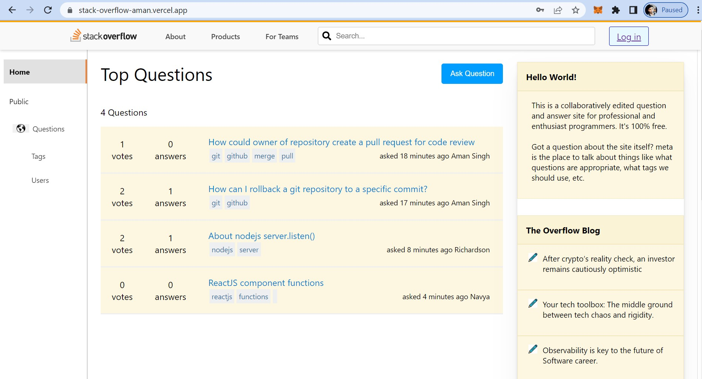

<br/>
<p align="center">
  <a href="https://github.com/amansingh1221/StackOverflow">
    
  </a>

  <h3 align="center">Stack OverFlow Clone</h3>

  <p align="center">
    Get unstuck with our Stack Overflow clone - where knowledge meets community!
    <br/>
    <br/>
    <a href="https://github.com/amansingh1221/StackOverflow"><strong>Explore the docs »</strong></a>
    <br/>
    <br/>
    <a href="https://github.com/amansingh1221/StackOverflow">View Demo</a>
    .
    <a href="https://github.com/amansingh1221/StackOverflow/issues">Report Bug</a>
    .
    <a href="https://github.com/amansingh1221/StackOverflow/issues">Request Feature</a>
  </p>
</p>

      

## Table Of Contents

* [About the Project](#about-the-project)
* [Built With](#built-with)
* [Getting Started](#getting-started)
  * [Installation](#installation)
* [Usage](#usage)
* [Contributing](#contributing)
* [Authors](#authors)
* [Acknowledgements](#acknowledgements)

## About The Project



This Project is based on MERN Stack which is a web application that provides users a platform to ask, resolve and share their queries. Users can sign up and log in to their account, Ask questions and answer the queries of other users.

The project consists of two main parts: the front-end and the back-end. The front-end is built with ReactJS, a popular JavaScript library for building user interfaces. The back-end is built with NodeJS, a runtime environment for executing JavaScript code outside of a web browser.

The front-end is responsible for rendering the user interface and handling user interactions. It uses ReactJS components to create reusable UI elements and provides a seamless user experience. The back-end is responsible for handling data storage, authentication, and communication between the client and the server. It uses NodeJS modules to implement server-side logic and provides RESTful APIs for communication with the client.

Some of the key features of the application include:

User authentication and authorization using JWT tokens
Posting user queries and their answers.
The project is designed to be scalable and modular, allowing for easy maintenance and future enhancements. It can be deployed on Vercel and can be integrated with  MongoDB database. 

Overall, This project provides a comprehensive solution for users to resolve their queries online within no time, while also providing modern technologies for a fast and seamless user experience.

## Built With

The whole project is based on MERN Stack.Here I use MongoDB, Expess, Reactjs and Nodejs as a major frameworks. 
Front-end as well as Backend both are deployed on Vercel and here is the link to the Stack Overflow Clone: https://stack-overflow-aman.vercel.app/

## Getting Started

This is an example of how you setting up your project locally.
To get a local copy up and running follow these simple example steps.

### Installation

1. Clone the repository: ```git clone https://github.com/amansingh1221/StackOverflow.git```
2. Navigate to the project directory: ```cd client```
3. Install dependencies: npm install
4. Navigate to the project directory: ```cd server```
5. Install dependencies: npm install

## Usage

```npm install``` Use the above command on the client side to install dependencies

```npm install```
Use the above command on the server side to install dependencies

```npm start```
Use the above command on the client side to run client

```npm start```
Use the above command on the server side to run server

## Contributing

Contributions are what make the open source community such an amazing place to be learn, inspire, and create. Any contributions you make are **greatly appreciated**.
* If you have suggestions for adding or removing projects, feel free to [open an issue](https://github.com/amansingh1221/StackOverflow/issues/new) to discuss it, or directly create a pull request after you edit the *README.md* file with necessary changes.
* Please make sure you check your spelling and grammar.
* Create individual PR for each suggestion.
* Please also read through the [Code Of Conduct](https://github.com/amansingh1221/StackOverflow/blob/main/CODE_OF_CONDUCT.md) before posting your first idea as well.

### Creating A Pull Request

1. Fork the Project
2. Create your Feature Branch (`git checkout -b feature/AmazingFeature`)
3. Commit your Changes (`git commit -m 'Add some AmazingFeature'`)
4. Push to the Branch (`git push origin feature/AmazingFeature`)
5. Open a Pull Request

## Authors

* **Aman Singh** - *Computer Science and Engineering student Student* - [Aman Singh](https://github.com/amansingh1221) - *Built Stack Overflow clone*


